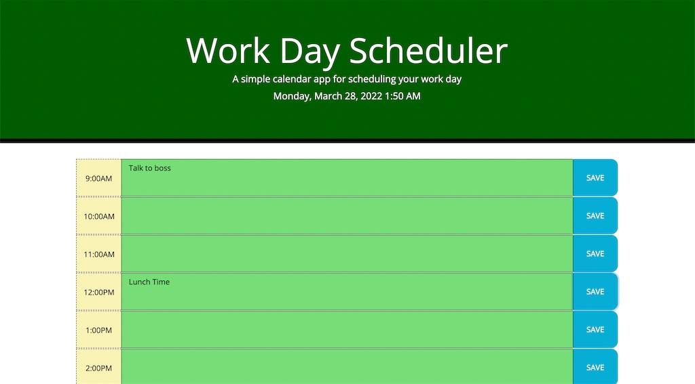

# Schedule-it

## Purpose

To create a workday scheduler which displays today's date, the different hours of the work day, and any saved tasks for the day. The save tasks must be retrievable when the page is later reloaded.

## Built With

- HTML
- CSS
- Bootstrap
- JavaScript
- jQuery
- Moment.js

## Website

https://narcpat.github.io/schedule-it

## Contribution

Made with ❤️ by Patrick Narcisse (aka narcpat)

## Credits

A lot of the logic that was used was inspired by the previous Module project "TaskMaster Pro".

I used various cheat sheets including:
https://htmlcheatsheet.com/jquery/
https://devhints.io/moment

others are cited in the comments.

## Special Thanks

A special thanks to Learning Assistants Jon and Royce, as well as classmates who helped during times where I was stuck.
